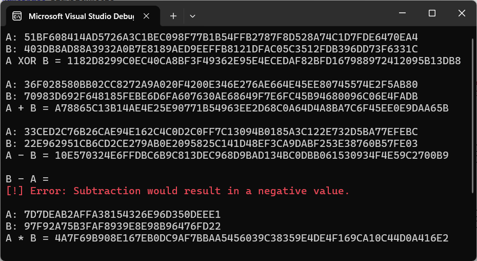
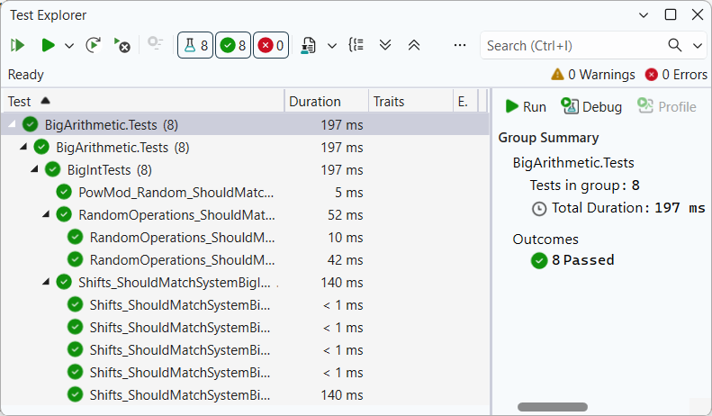

# BigInt Arithmetic Library

[](https://opensource.org/licenses/MIT)
[](https://docs.microsoft.com/en-us/dotnet/csharp/)

A custom high-performance library for handling large natural numbers, designed for cryptographic applications. This library implements bitwise and arithmetic operations using a 32-bit block-based storage system.

## ⚡ Features
- **Efficient Storage**: Numbers are stored as arrays of unsigned 32-bit integers (`uint[]`).
- **Bitwise Operations**: `XOR`, `OR`, `AND`, `NOT`, and bitwise shifts (`<<`, `>>`).
- **Arithmetic Operations**: High-precision `Addition`, `Subtraction`, `Multiplication`, `Division`, and `Modulo`.
- **Cryptographic Primatives**: Fast modular exponentiation (`PowMod`) using the binary exponentiation algorithm.
- **Hexadecimal Support**: Seamless conversion between Hex strings and internal BigInt representation.

## 📁 Project Structure
```
├── docs/
│   ├── demo_output.png             # CLI execution results on test vectors
│   └── unit_tests_passed.png       # Screenshot of successful xUnit execution
├── src/BigArithmetic/
│   ├── BigArithmetic.csproj        # Project configuration
│   ├── BigInt.cs                   # Main class implementing BigInt logic
│   └── Program.cs                  # Demo application entry point
├── tests/BigArithmetic.Tests/
│   ├── BigArithmetic.Tests.csproj  # Test project configuration
│   └── BigIntTests.cs              # xUnit tests (Cross-validation with System.Numerics)
├── .gitignore                      # Standard .NET ignore rules     
├── BigArithmetics.slnx             # Visual Studio Solution
└── README.md
```

## 🚀 How to Run
1. **Prerequisites**:
* **[.NET 8.0 SDK](https://dotnet.microsoft.com/download)** (or newer).
* **[Visual Studio](https://visualstudio.microsoft.com/)** (2022 or newer) installed with the **.NET desktop development** workload.
2. **Clone the repo:**
```bash
git clone https://github.com/AnastasiaZAYU/cryptography-for-developers.git
```
3. Open `BigArithmetic.slnx` in **Visual Studio**.
4. Build and run the project (F5).

## 🛠 Usage
### Code Example
The library overloads standard C# operators for intuitive and readable code:

```csharp
// Initialize from Hex
var a = BigInt.FromHex("7d7deab2affa38154326e96d350deee1");
var b = BigInt.FromHex("97f92a75b3faf8939e8e98b96476fd22");
var e = BigInt.FromHex("4b6e");
var m = BigInt.FromHex("51bf6084403db8ad51bf6084403db8ad");

// Arithmetic & Bitwise
BigInt sum = a + b;
BigInt xorResult = a ^ b;
BigInt invA = ~a;

// Cryptographic power function (a^e mod m)
BigInt power = BigInt.PowMod(a, e, m);

// Output result
Console.WriteLine($"Result: {power.ToHex()}");
```

### API Reference

| Category | Method / Operator | Description |
| :--- | :--- | :--- |
| **Initialization** | `BigInt.FromHex(string)` | Creates a `BigInt` from a hexadecimal string. |
| **Output** | `ToHex()` | Returns the hexadecimal string representation. |
| **Arithmetic** | `+` , `-` , `*` , `/` , `%` | Standard operations (carry-borrow propagation). |
| **Bitwise** | `^` , `\|` , `&` , `~` | Logical XOR, OR, AND, and NOT (Inversion). |
| **Shifts** | `<<` , `>>` | Logical bitwise left and right shifts. |
| **Crypto** | `BigInt.PowMod(a, e, m)` | Efficient modular exponentiation ($a^e \pmod m$). |


### Interactive Demo
The included console application demonstrates these operations using official test vectors provided in the assignment:



## 🧪 Testing & Validation
Reliability is critical for cryptographic software. This project employs a **Cross-Validation** strategy using the **xUnit** framework:

- **Automated Differential Testing**: Each operation is compared against the industry-standard `System.Numerics.BigInteger` implementation.
- **Randomized Stress Tests**: The library is tested with thousands of random bit-length inputs (from 128 to 1024 bits) to ensure stability under different data scales.
- **Edge Case Coverage**: Specific tests for zero values, arithmetic carry/borrow boundaries, and bit-shifts across 32-bit block limits.
- **Static Test Vectors:** Verification against pre-defined hexadecimal test vectors to ensure absolute precision for known results.



## 🏗 Implementation Details

- **Storage**: Little-endian word order using `uint[]` arrays. Each word represents $2^{32}$.
- **Addition/Subtraction**: Classic schoolbook algorithms with manual carry/borrow propagation.
- **Multiplication**: Iterative word-by-word multiplication ($O(N^2)$ complexity).
- **Division/Modulo**: Bit-by-bit long division algorithm, optimized for large integers.
- **PowMod**: Implemented using the **Right-to-Left Binary Exponentiation** (Square-and-Multiply) algorithm for $O(\log e)$ performance.

## 📄 License

This project is licensed under the MIT License - see the [LICENSE](../LICENSE) file for details.
