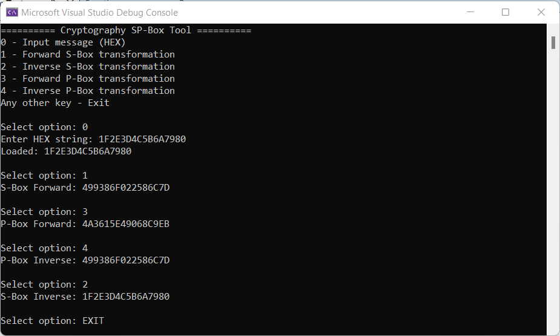
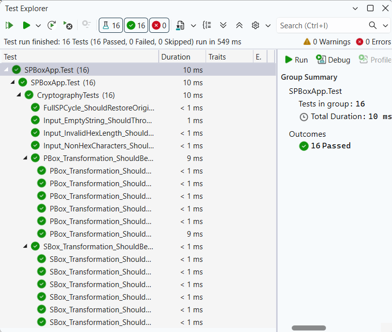

# S-Box and P-Box Cryptographic Tool

[](https://opensource.org/licenses/MIT)
[](https://docs.microsoft.com/en-us/dotnet/csharp/)

A C# implementation of a simple substitution-permutation network (SP-network). This project demonstrates the core principles of modern symmetric cryptography: confusion (via S-Box) and diffusion (via P-Box).

## 📌 Overview
This tool provides a CLI interface to perform forward and inverse transformations on HEX-encoded data. It is designed to be a learning resource for understanding how block ciphers manipulate data at the byte and bit levels.

### Key Components:
- **S-Box (Substitution):** Implements confusion by replacing nibbles (4-bit chunks) using lookup tables.
- **P-Box (Permutation):** Implements diffusion by reshuffling bits within an 8-bit block.
- **Reversibility:** Fully supports inverse operations to restore original data.

## 📂 Project Structure
```
├── docs/
│   └── cli_demo.png            # Screenshot of the interactive CLI session
│   └── tests_passed.png        # Screenshot of successful unit test execution
├── src/SPBoxApp/
│   ├── Functions.cs            # Core cryptographic logic (S-Box, P-Box, Table Init)
│   ├── Program.cs              # Main entry point and CLI menu logic   
│   └── SPBoxApp.csproj         # Project configuration
├── tests/SPBoxApp.Test/
│   ├── CryptographyTests.cs    # xUnit tests for reversibility and validation
│   └── SPBoxApp.Test.csproj    # Test project configuration and dependencies
├── .gitignore                  # Standard .NET ignore rules     
├── README.md             
└── SPBoxApp.slnx               # Visual Studio Solution       
```

## 🛠 Features
- **Dynamic Table Initialization:** S-Boxes and P-Boxes are generated using the `Fisher-Yates shuffle` with `RandomNumberGenerator` for unbiased, cryptographically secure randomization.
- **Memory Efficiency:** Utilizes `Span<byte>` and `ReadOnlySpan<byte>` for memory-efficient data manipulation.
- **Comprehensive Test Suite:** Includes xUnit tests for ensuring transformation reversibility, input validation, and full SP-network cycle integrity.

## 📸 Demo
### Interactive CLI
The following image demonstrates a full cycle: loading data, applying S-Box and P-Box, and then reversing the process:



### Unit Tests Execution
Verified with xUnit. All tests covering transformation logic and HEX input validation are passing:



## 🚀 How to Run
1. **Prerequisites**:
* **[.NET 8.0 SDK](https://dotnet.microsoft.com/download)** (or newer).
* **[Visual Studio](https://visualstudio.microsoft.com/)** (2022 or newer) installed with the **.NET desktop development** workload.
2. **Clone the repo:**
```bash
git clone https://github.com/AnastasiaZAYU/cryptography-for-developers.git
```
3. Open `SPBoxApp.slnx` in **Visual Studio**.
4. Build and run the project (F5).

## 📄 License

This project is licensed under the MIT License - see the [LICENSE](../LICENSE) file for details.
