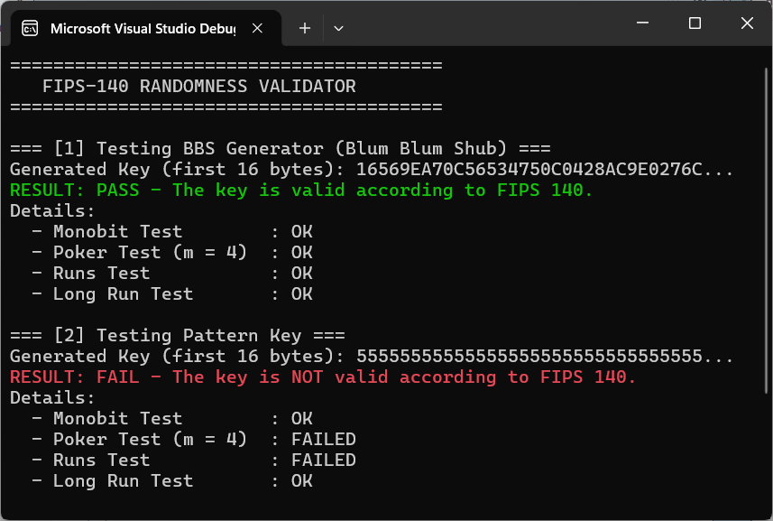
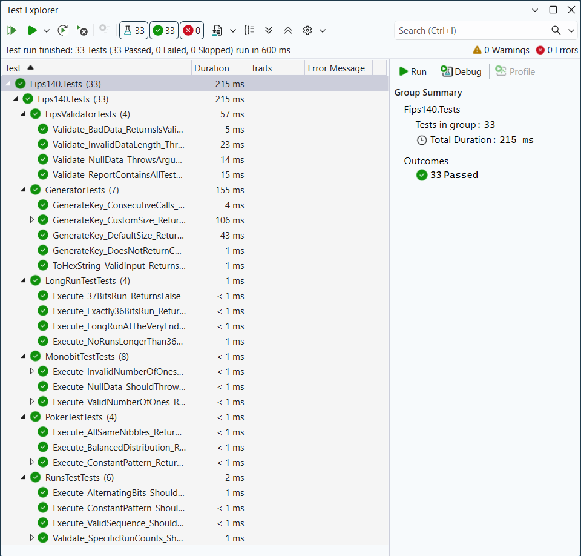

# FIPS 140 Randomness Validator

[](https://opensource.org/licenses/MIT)
[](https://docs.microsoft.com/en-us/dotnet/csharp/)

This project implements a cryptographically secure pseudo-random number generator (CSPRNG) based on the **Blum Blum Shub (BBS)** algorithm and a comprehensive validation suite according to the **FIPS 140** statistical tests.

## ⚡Features
- **BBS Generator**: A secure generator using `BigInteger` for modular exponentiation.
- **Statistical Suite**: Implementation of four mandatory FIPS tests:
  - **Monobit Test**: Checks the balance of 0s and 1s.
  - **Poker Test (m=4)**: Evaluates the distribution of 4-bit nibbles.
  - **Runs Test**: Analyzes the distribution of consecutive bit sequences.
  - **Long Run Test**: Detects abnormally long sequences of identical bits (threshold = 36).
- **Unit Testing**: Comprehensive **xUnit** test suite with 33 tests covering edge cases and boundary conditions.

## 📁 Project Structure
```
├── docs/
│   ├── demo_output.png                      # Example of the application's console output
│   └── unit_tests_passed.png                # Screenshot of successful xUnit execution
├── src/Fips140.RandomnessTesting/
│   ├── Fips140.RandomnessTesting.csproj     # Project configuration and dependencies
│   ├── FipsValidator.cs                     # Orchestrator that runs all statistical tests
│   ├── Generator.cs                         # BBS algorithm implementation and hex formatting
│   ├── IRandomnessTest.cs                   # Common interface for all FIPS tests
│   ├── LongRunTest.cs                       # Detects runs of 37+ identical bits
│   ├── MonobitTest.cs                       # Validates the total count of ones (9654-10346)
│   ├── PokerTest.cs                         # Computes Chi-square for 4-bit nibbles
│   ├── Program.cs                           # Entry point: generates a key and displays report
│   └── RunsTest.cs                          # Checks distribution of run lengths (1 to 6+)
├── tests/Fips140.Tests/
│   ├── Fips140.Tests.csproj                 # Test project configuration
│   ├── FipsValidatorTests.cs                # Tests for input validation and reporting logic
│   ├── GeneratorTests.cs                    # Verifies BBS output size and determinism
│   ├── LongRunTestTests.cs                  # Boundary tests for sequences of 36/37 bits
│   ├── MonobitTestTests.cs                  # Tests for min/max bit count limits
│   ├── PokerTestTests.cs                    # Tests for balanced vs skewed nibble distribution
│   └── RunsTestTests.cs                     # Validates all 12 intervals for run lengths
├── .gitignore                               # Standard .NET ignore rules
├── Fips140.RandomnessTesting.slnx           # Visual Studio Solution
└── README.md  
```

## 🚀 How to Run
1. **Prerequisites**:
* **[.NET 8.0 SDK](https://dotnet.microsoft.com/download)** (or newer).
* **[Visual Studio](https://visualstudio.microsoft.com/)** (2022 or newer) installed with the **.NET desktop development** workload.
2. **Clone the repo:**
```bash
git clone https://github.com/AnastasiaZAYU/cryptography-for-developers.git
```
3. Open `Fips140.RandomnessTesting.slnx` in **Visual Studio**.
4. Build and run the project (F5).

## 🛠 Usage
### Basic Execution
The library provides a straightforward API to generate keys and validate them against FIPS 140 standards. You can use the 'FipsValidator' to get a detailed report for any 20,000-bit sequence.

```csharp
// 1. Initialize the components
var generator = new Generator();
var validator = new FipsValidator();

// 2. Generate a 2500-byte (20,000-bit) key using BBS
byte[] key = generator.GenerateKey(2500);

// 3. Validate the key and print the summary
PrintResult(validator.Validate(key));
```

### Manual Validation
If you already have a hex-encoded key, you can validate it directly:

```csharp
var validator = new FipsValidator();
// Your 5000-character hex string representing 20,000 bits
byte[] key = Convert.FromHexString("FC7318843E44C486D8554027C52EA1BD...");

PrintResult(validator.Validate(key));
```

## 📊 Results
The application generates a 20,000-bit key (2500 bytes) and runs it through the validator. Below is the output showing the test results:



## 🧪 Testing & Validation
The project follows a test-driven approach with **33 xUnit tests**. These tests verify not only the "happy path" (random data passing) but also critical boundary conditions:
- **Mathematical Accuracy**: Ensuring Monobit, Poker, and Runs tests strictly follow the FIPS 140 probability intervals.
- **Boundary Conditions**: Validation of runs at byte boundaries and the exact 36/37-bit threshold for the Long Run Test.
- **Determinism**: Verifying that the BBS Generator produces consistent results with a fixed seed and provides sufficient entropy.
- **Fail-Fast Logic**: Ensuring the `FipsValidator` correctly reports failure if even a single statistical test fails.



## 📚 Standards Compliance
This implementation follows the statistical randomness requirements originally defined in **FIPS 140**:
- **Monobit Test**: $9654 \le n_1 \le 10346$
- **Poker Test** ($m=4$): $1.03 < X_3 < 57.4$
- **Runs Test**: Specific intervals for runs of lengths 1, 2, 3, 4, 5, and 6+ (for both zeros and ones).
- **Long Run Test**: No run of length $\ge 37$ is allowed ($Max \le 36$).

## 📄 License

This project is licensed under the MIT License - see the [LICENSE](../LICENSE) file for details.
