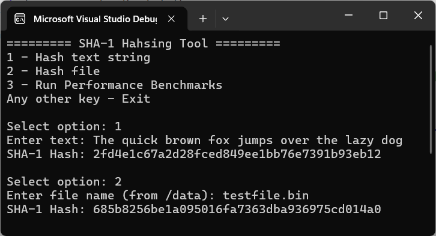
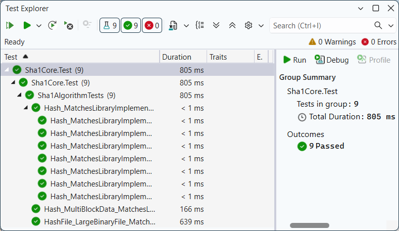
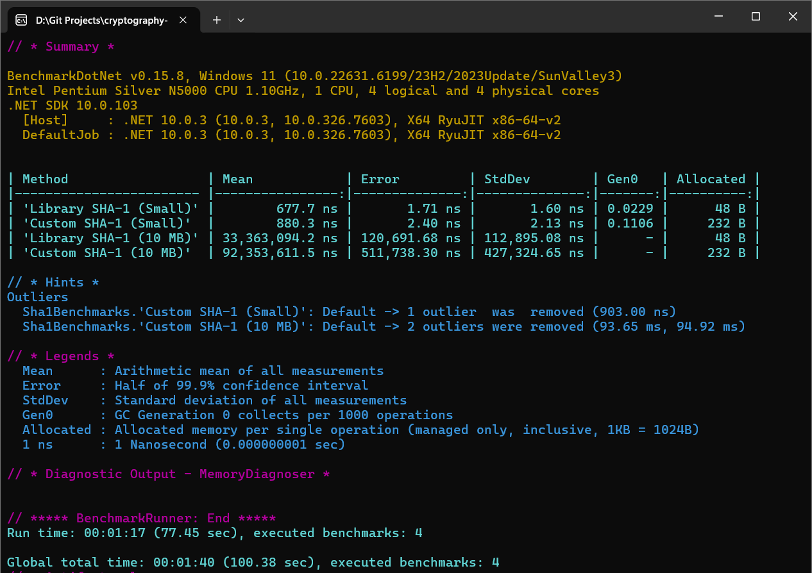

# SHA-1 Core Implementation

[](https://opensource.org/licenses/MIT)
[](https://docs.microsoft.com/en-us/dotnet/csharp/)

A high-performance C# implementation of the SHA-1 (Secure Hash Algorithm 1) designed with memory efficiency and modern .NET practices in mind.

## ⚡ Features
- **Custom SHA-1 Implementation:** Built from scratch using FIPS 180-1 specifications.
- **Memory Efficient:** Utilizes `ReadOnlySpan<byte>` and `stackalloc` to minimize heap allocations.
- **Streaming Support:** Ability to process data in chunks (useful for large files).
- **Utility Helpers:** Built-in methods for hashing text strings and physical files.
- **Automated Benchmarking:** Integrated performance testing vs. the standard library.

## 📁 Project Structure
```
├── data/
│   └── testfile.bin                # Sample binary file for hashing tests
├── docs/
│   ├── benchmarks_performance.png  # Screenshot of BenchmarkDotNet results
│   ├── cli_demo.png                # Screenshot of the interactive CLI session
│   └── unit_tests_passed.png       # Screenshot of successful xUnit execution
├── src/Sha1Core/
│   ├── Program.cs                  # Main entry point and CLI menu logic 
│   ├── Sha1Benchmarks.cs           # BenchmarkDotNet performance test cases
│   ├── Sha1Core.csproj             # Project configuration and dependencies
│   └── Sha1Hasher.cs               # Core cryptographic logic (Padding, Blocks, Rotations) 
├── tests/Sha1Core.Test/
│   ├── Sha1AlgorithmTests.cs       # xUnit tests for logic validation and edge cases
│   └── Sha1Core.Test.csproj        # Test project configuration
├── .gitignore                      # Standard .NET ignore rules     
├── README.md
└── Sha1Core.slnx                   # Visual Studio Solution
```

## 🚀 How to Run
1. **Prerequisites**:
* **[.NET 8.0 SDK](https://dotnet.microsoft.com/download)** (or newer).
* **[Visual Studio](https://visualstudio.microsoft.com/)** (2022 or newer) installed with the **.NET desktop development** workload.
2. **Clone the repo:**
```bash
git clone https://github.com/AnastasiaZAYU/cryptography-for-developers.git
```
3. Open `Sha1Core.slnx` in **Visual Studio**.
4. Build and run the project (F5).

## 🛠 Usage
### CLI Application
The main application provides an interactive command-line interface to perform various hashing tasks.

### Available Options:
- `1` - **Hash text string:** Prompts for a text input and computes its SHA-1 hash using UTF-8 encoding.
- `2` - **Hash file:** Computes the hash for a file. By default, it looks into the `data/` directory (managed via `.csproj` to ensure test files are always present in the output folder).
- `3` - **Run Performance Benchmarks:** Automatically triggers the performance comparison suite.

> **Note on Files:** To hash a specific file, simply place it in the `data/` folder and enter its name (e.g., `testfile.bin`) when prompted.

### Interactive Demo
The following image demonstrates a typical user session. It showcases the menu structure and the process of hashing both a standard text string and a binary file from the local repository.



## 🧪 Testing & Validation
The implementation is rigorously verified using the **xUnit** framework. We compare our custom output against the standard `System.Security.Cryptography.SHA1` library to ensure 100% bit-for-bit compatibility.

### Key Test Cases:
- **Empty Strings:** Validating initial state and padding logic for zero-length input.
- **Boundary Conditions:** Testing messages with lengths of 55, 56, and 64 bytes (critical for SHA-1 padding and block overflow).
- **Multi-block Messages:** Ensuring correct chaining of the hash state over large data streams.
- **Large Files:** Streaming hash validation for binary files (up to 10MB+) to verify buffer stability.

### Unit Tests Execution
All tests are passing, confirming that the custom algorithm produces results identical to the official .NET implementation.



## 📊 Performance Benchmarks
To evaluate the efficiency of the custom implementation, we utilized the **BenchmarkDotNet** library. This suite performs a side-by-side comparison between `Sha1Hasher` and the native .NET `System.Security.Cryptography.SHA1` library across various payload sizes.

> [!IMPORTANT]
> **Performance Benchmarks must be run in Release configuration.**
> Running in *Debug* mode disables critical compiler optimizations (such as method inlining and loop unrolling), which leads to inaccurate and significantly degraded performance figures.

### To run benchmarks via terminal:
```bash
dotnet run -c Release --project src/Sha1Core/Sha1Core.csproj
```

### Comparative Analysis




Results obtained on an _Intel Pentium Silver N5000 (1.10GHz)_ platform:

| Method | Data Size | Mean Time | Allocated |
|:--- |:--- |:--- |:--- |
| Library SHA-1 | 100 B | 677.7 ns | 48 B |
| **Custom SHA-1** | 100 B | **880.3 ns** | **232 B** |
| Library SHA-1 | 10 MB | 33.3 ms | 48 B |
| **Custom SHA-1** | 10 MB | **92.3 ms** | **232 B** |

### Technical Observations:
- **Exceptional Memory Stability:** The custom implementation maintains a strictly **constant memory footprint of 232 bytes**, regardless of whether it processes 100 bytes or 10 megabytes. This is achieved through the strategic use of `ReadOnlySpan<byte>`, `stackalloc` for local buffers, and an efficient streaming architecture.
- **Execution Throughput:** While the native .NET library is faster (due to low-level hardware acceleration and SIMD instructions), the custom implementation demonstrates competitive performance for a managed-code solution. It processes a 10MB file in approximately **92ms**, making it highly suitable for high-integrity applications.
- **Zero Garbage Collection:** The `Gen0` column in the results confirms that the algorithm does not trigger pressure on the Garbage Collector, ensuring predictable performance in memory-constrained environments.

**Conclusion:** The benchmark results validate that the implementation is both robust and high-performing, successfully balancing algorithmic correctness with modern .NET memory optimization techniques.

## 📄 License

This project is licensed under the MIT License - see the [LICENSE](../LICENSE) file for details.
