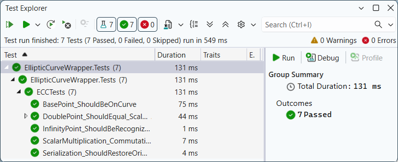

# Elliptic Curve Wrapper

[](https://opensource.org/licenses/MIT)
[](https://docs.microsoft.com/en-us/dotnet/csharp/)

A high-level, developer-friendly C# wrapper for **Elliptic Curve Cryptography (ECC)** operations. This project provides a clean abstraction over the `BouncyCastle` library, simplifying point arithmetic and curve validation.

## ⚡Features
- **Simplified ECC Arithmetic**: Easy-to-use methods for point addition, doubling, and scalar multiplication.
- **Strongly Typed**: Uses C# `record struct` for immutable and thread-safe EC points.
- **Standard Curve Support**: Pre-configured for `secp256k1` (standard for Bitcoin/Ethereum), but extensible to other named curves.
- **Robust Serialization**: Built-in HEX serialization/deserialization for persistent storage or network transmission.
- **Full Validation**: Automatic check if a point belongs to the curve equation.

## 📁 Project Structure
```
├── docs/
│   └── unit_tests_passed.png                # Screenshot of successful xUnit execution
├── src/EllipticCurveWrapper/  
│   ├── BouncyCastleWrapper.cs               # Main implementation using BouncyCastle library
│   ├── ECPoint.cs                           # Immutable data structure for Elliptic Curve points
│   ├── EllipticCurveWrapper.csproj          # Project configuration and dependencies
│   ├── IEllipticCurveService.cs             # Interface defining core ECC operations
│   └── Program.cs                           # Entry point for console demonstration
├── tests/EllipticCurveWrapper.Tests/
│   ├── ECCTests.cs                          # xUnit test suite for math and serialization
│   └── EllipticCurveWrapper.Tests.csproj    # Test project configuration
├── .gitignore                               # Standard .NET ignore rules
├── EllipticCurveWrapper.slnx                # Visual Studio Solution
└── README.md  
```

## 🏗️ Architecture
- **Abstraction**: `IEllipticCurveService` interface allows for swapping the underlying crypto provider.
- **Immutability**: `ECPoint` is implemented as a `readonly record struct`, ensuring thread safety.
- **Provider**: `BouncyCastleWrapper` encapsulates the complexity of the `BouncyCastle` library.

## 🚀 How to Run
1. **Prerequisites**:
* **[.NET 8.0 SDK](https://dotnet.microsoft.com/download)** (or newer).
* **[Visual Studio](https://visualstudio.microsoft.com/)** (2022 or newer) installed with the **.NET desktop development** workload.
2. **Clone the repo:**
```bash
git clone https://github.com/AnastasiaZAYU/cryptography-for-developers.git
```
3. Open `EllipticCurveWrapper.slnx` in **Visual Studio**.
4. Build and run the project (F5).

## 🛠 Usage
### Code Example

The following snippet demonstrates how to initialize the service using the `secp256k1` curve and perform basic scalar multiplication. By utilizing the `IEllipticCurveService` interface, you can easily integrate ECC operations while keeping your code decoupled from the underlying provider.

```csharp
using System.Numerics;
using EllipticCurveWrapper;

// Inside your Main method:
// --------------------------------------------------

// Initialize service
IEllipticCurveService ecc = new BouncyCastleWrapper("secp256k1");

// Get Generator point
var G = ecc.BasePointGGet();

// Scalar Multiplication
var k = BigInteger.Parse("123456789...");
var publicPoint = ecc.ScalarMult(k, G);

Console.WriteLine($"Public Point: {publicPoint}");
```

### API Reference
The library provides a set of high-level methods for Elliptic Curve arithmetic and utility operations.

| Category | Method | Description |
| :--- | :--- | :--- |
| **Generators** | `BasePointGGet()` | Retrieves the curve generator point $G$. |
| **Validation** | `IsOnCurveCheck(ECPoint point)` | Verifies if a given point $(x, y)$ satisfies the curve equation. |
| **Arithmetic** | `AddECPoints(ECPoint p, ECPoint q)` | Performs point addition: $R = P + Q$. |
| **Arithmetic** | `DoubleECPoints(ECPoint p)` | Performs point doubling: $R = 2P$. |
| **Arithmetic** | `ScalarMult(BigInteger k, ECPoint p)` | Performs scalar multiplication: $R = k \cdot P$. |
| **Serialization**| `ECPointToString(ECPoint p)` | Encodes a point into an uncompressed HEX string. |
| **Serialization**| `StringToECPoint(string s)` | Decodes a HEX string back into an `ECPoint` structure. |

## 🧪 Testing & Validation
To guarantee cryptographic precision, the project implements an automated **xUnit** test suite. The core validation logic ensures that all EC operations satisfy the group law properties.

### Key Test Scenarios:
- **Mathematical Identities**: Verifies the commutative property: $k \cdot (d \cdot G) = d \cdot (k \cdot G)$.
- **Arithmetic Integrity**: Validates that `DoubleECPoints(P)` yields the same result as `ScalarMult(2, P)`.
- **Edge Case Handling**: Specialized checks for the **Point at Infinity** and boundary values.
- **Serialization Round-trip**: Ensures that points remain identical after HEX encoding/decoding.

> **Note**: All tests utilize `RandomNumberGenerator` for cryptographically secure, non-deterministic input validation.



## 📄 License

This project is licensed under the MIT License - see the [LICENSE](../LICENSE) file for details.
