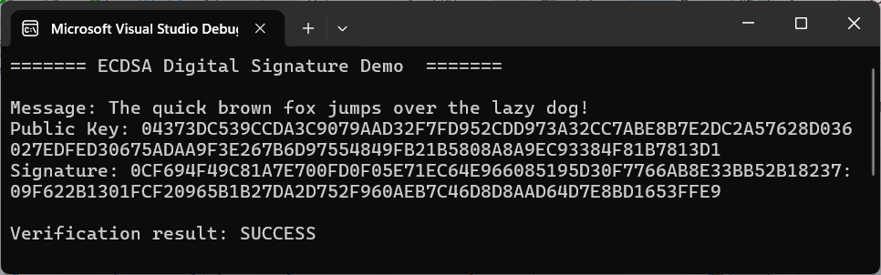
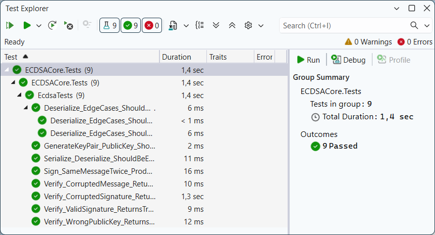

# ECDSA Digital Signature Core

[](https://opensource.org/licenses/MIT)
[](https://docs.microsoft.com/en-us/dotnet/csharp/)

A C# implementation of the **Elliptic Curve Digital Signature Algorithm (ECDSA)** using the `secp256k1` curve. This project demonstrates a decoupled architecture, manual cryptographic calculations (modular inverse, point addition, scalar multiplication), and comprehensive unit testing.

## ⚡ Features
- **Custom ECDSA Implementation**: Manual implementation of key generation, signing, and verification.
- **Infrastructure Abstraction**:
  - `IEllipticCurveService`: Wrapper for low-level curve operations (powered by `BouncyCastle`).
  - `IHashService`: Standalone hashing service using SHA-256.
- **Cryptographic Security**: Uses `System.Security.Cryptography.RandomNumberGenerator` for secure entropy when generating private keys and the ephemeral $k$ value.
- **Hex Serialization**: Built-in support for serializing signatures into a `r:s` Hex format.
- **xUnit Testing**: 100% coverage of core cryptographic scenarios.

## 📁 Project Structure
```
├── docs/
│   ├── demo_output.png                 # Example of the application's console output
│   └── unit_tests_passed.png           # Screenshot of successful xUnit execution
├── src/ECDSACore/
│   ├── Infrastructure/
│   │   ├── BouncyCastleWrapper.cs      # Implementation of EC math using BouncyCastle
│   │   ├── ECPoint.cs                  # Custom struct for Elliptic Curve points
│   │   ├── IEllipticCurveService.cs    # Interface for curve operations
│   │   ├── IHashService.cs             # Interface for message hashing
│   │   └── Sha256HashService.cs        # SHA-256 implementation
│   ├── ECDSACore.csproj                # Project configuration and dependencies
│   ├── EcdsaService.cs                 # Core ECDSA signing and verification logic
│   ├── IDigitalSignature.cs            # Interface for signature services
│   └── Program.cs                      # Console demo application
├── tests/ECDSACore.Tests/
│   ├── ECDSACore.Tests.csproj          # Test project configuration
│   └── EcdsaTests.cs                   # Comprehensive xUnit tests for ECDSA logic
├── .gitignore                          # Standard .NET ignore rules     
├── ECDSACore.slnx                      # Visual Studio Solution
└── README.md
```

## 🚀 How to Run
1. **Prerequisites**:
* **[.NET 8.0 SDK](https://dotnet.microsoft.com/download)** (or newer).
* **[Visual Studio](https://visualstudio.microsoft.com/)** (2022 or newer) installed with the **.NET desktop development** workload.
2. **Clone the repo:**
```bash
git clone https://github.com/AnastasiaZAYU/cryptography-for-developers.git
```
3. Open `ECDSACore.slnx` in **Visual Studio**.
4. Build and run the project (F5).

## 🛠 Usage

### Code Example
The library is designed for simplicity and follows the **Dependency Injection** pattern. Below is a quick lifecycle demonstrating how to initialize the services and perform the signing process:
```csharp
// 1. Initialize services (Composition Root)
var ecService = new BouncyCastleWrapper("secp256k1");
var hashService = new Sha256HashService();
var ecdsa = new EcdsaService(ecService, hashService);

// 2. Generate a high-entropy key pair
var (privateKey, publicKey) = ecdsa.GenerateKeyPair();

// 3. Sign a message
string message = "The quick brown fox jumps over the lazy dog!";
var (r, s) = ecdsa.Sign(message, privateKey);

// 4. Verify the digital signature
bool isValid = ecdsa.Verify(message, r, s, publicKey);
Console.WriteLine($"Signature Valid: {isValid}");
```

### API Reference

| Method | Description |
| :--- | :--- |
| `GenerateKeyPair()` | Generates a high-entropy private key (scalar) and a corresponding public key (EC point). |
| `Sign(message, privKey)` | Creates a digital signature $(r, s)$ for the given message using the private key. |
| `Verify(message, r, s, pubKey)` | Validates the signature $(r, s)$ against the public key and the original message. |
| `SerializeSignature(r, s)` | Converts the $r$ and $s$ components into a compact Hex-encoded string (`r:s`). |
| `DeserializeSignature(hex)` | Parses a Hex-encoded string back into its original `BigInteger` $r$ and $s$ components. |

### Interactive Demo
The console application showcases the full cryptographic lifecycle of a digital signature. It generates high-entropy parameters, creates a unique key pair, and performs **message signing** and **signature verification** to ensure data integrity and authenticity:



## 🧪 Testing & Validation

The project includes a robust test suite covering:
- **Integrity**: Verification fails if the message is modified.
- **Authenticity**: Verification fails if a different public key is used.
- **Non-determinism**: Signing the same message twice produces different signatures (as per ECDSA standards).
- **Format Integrity**: Serialization/Deserialization consistency.



## 📜 Mathematical Reference
The implementation follows the standard ECDSA process:
1. **Signing**: $$s = k^{-1}(z + rd_A) \pmod n$$
2. **Verification**: $$P = (u_1G + u_2Q_A), \text{ where } r \equiv x_P \pmod n$$

## 📄 License

This project is licensed under the MIT License - see the [LICENSE](../../LICENSE) file for details.
