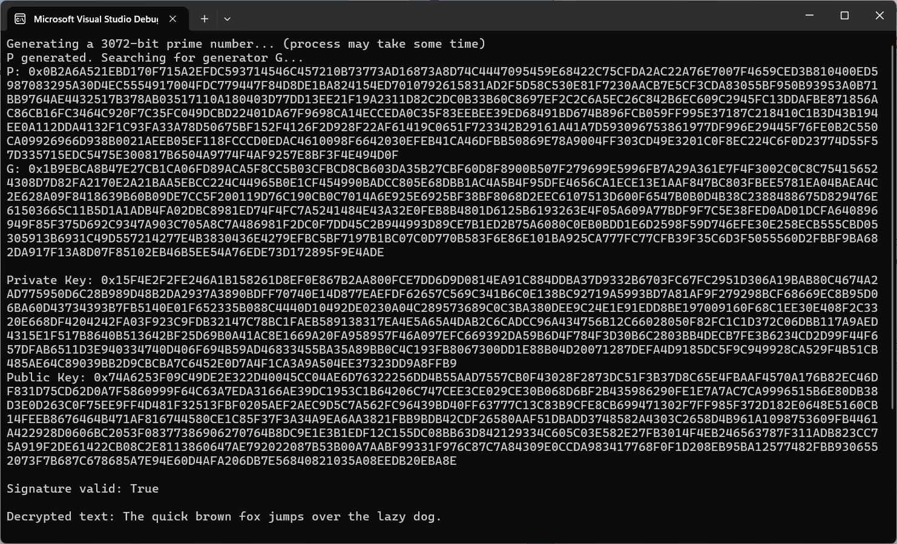
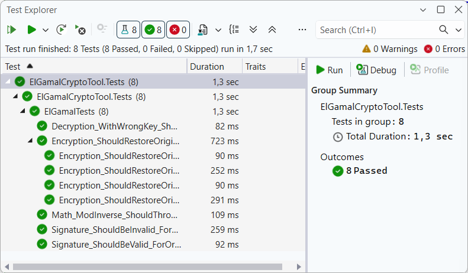

# ElGamal Cryptosystem (C# Implementation)

[](https://opensource.org/licenses/MIT)
[](https://docs.microsoft.com/en-us/dotnet/csharp/)

A robust, pedagogical implementation of the ElGamal asymmetric encryption and digital signature algorithm using .NET `BigInteger`. This project demonstrates modern C# practices in cryptography, focusing on precision, block-based processing, and secure prime generation.

## ⚡ Features

- **Asymmetric Encryption**: Secure message encryption/decryption using ephemeral keys and shared secrets.
- **Digital Signatures**: Implementation of the ElGamal signature scheme with SHA-256 hashing.
- **Secure Prime Generation**: Custom Miller-Rabin primality test for generating primes up to 3072 bits.
- **Smart Block Management**: Automatic message splitting and padding to handle texts of any length.
- **Hexadecimal Interop**: Built-in Hex formatting for easy debugging and compatibility with Python/OpenSSL outputs.

## 📁 Project Structure
```
├── docs/
│   ├── demo_output.png                 # CLI execution results on test vectors
│   └── unit_tests_passed.png           # Screenshot of successful xUnit execution
├── src/ElGamalCryptoTool/
│   ├── ElGamalCiphertext.cs            # Structure for (X, Y) cipher components
│   ├── ElGamalCryptoTool.csproj        # Project configuration and dependencies
│   ├── ElGamalKeyPair.cs               # Container for Private and Public keys
│   ├── ElGamalMath.cs                  # Core math: ModInverse, Miller-Rabin, GCD, and Secure Random
│   ├── ElGamalParameters.cs            # Domain model for system parameters (P, G)
│   ├── ElGamalService.cs               # Main logic for Encrypt/Decrypt and Sign/Verify
│   ├── ElGamalSignature.cs             # Structure for (R, S) signature components
│   └── Program.cs                      # Demo application entry point
├── tests/ElGamalCryptoTool.Tests/
│   ├── ElGamalCryptoTool.Tests.csproj  # Test project configuration
│   └── ElGamalTests.cs                 # Comprehensive xUnit suite for all crypto operations
├── .gitignore                          # Standard .NET ignore rules     
├── ElGamalCryptoTool.slnx              # Visual Studio Solution
└── README.md                 
```

## 🏗 Implementation Details

1. **Mathematics & Security**  
The system relies on the discrete logarithm problem. Key components include:
   - **Miller-Rabin Test**: A probabilistic primality test with configurable iterations (default $k=20$) and small prime pre-filtering for speed.
   - **Extended Euclidean Algorithm**: Used for calculating the Modular Multiplicative Inverse.
   - **Cryptographically Secure Random**: Utilizes `RandomNumberGenerator` to prevent predictability.

2. **Message Processing**
   - **Endianness Control**: Strict use of `isBigEndian: true` during `BigInteger` conversion to ensure compatibility across different systems.
   - **Block Padding**: Implements manual zero-padding for decrypted blocks to prevent data loss when `BigInteger` trims leading zero bytes.


## 🚀 How to Run
1. **Prerequisites**:
* **[.NET 8.0 SDK](https://dotnet.microsoft.com/download)** (or newer).
* **[Visual Studio](https://visualstudio.microsoft.com/)** (2022 or newer) installed with the **.NET desktop development** workload.
2. **Clone the repo:**
```bash
git clone https://github.com/AnastasiaZAYU/cryptography-for-developers.git
```
3. Open `ElGamalCryptoTool.slnx` in **Visual Studio**.
4. Build and run the project (F5).

## 🛠 Usage

### Code Example
The library is designed for simplicity. Here is a quick lifecycle:
```csharp
var service = new ElGamalService();

// 1. Setup (3072-bit for high security)
var parameters = service.GenerateParameters(3072);
var keys = service.GenerateKeyPair(parameters);

// 2. Encryption
var cipher = service.Encrypt("Hello, Cryptography!", parameters, keys.PublicKey);
string plaintext = service.Decrypt(cipher, parameters, keys.PrivateKey);

// 3. Digital Signature
var sign = service.Sign("Secure Document", parameters, keys.PrivateKey);
bool isValid = service.Verify("Secure Document", sign, parameters, keys.PublicKey);
```

### API Reference

| Method | Parameters | Return Type | Description |
| :--- | :--- | :--- | :--- |
| **`GenerateParameters`** | `int bitLength` | `ElGamalParameters` | Generates a secure large prime $P$ and a generator $G$. |
| **`GenerateKeyPair`** | `ElGamalParameters` | `ElGamalKeyPair` | Creates a matching pair of Private ($x$) and Public ($y$) keys. |
| **`Encrypt`** | `string msg`, `params`, `pubKey` | `ElGamalCiphertext` | Splits message into blocks and encrypts them using the public key. |
| **`Decrypt`** | `ciphertext`, `params`, `privKey` | `string` | Decodes encrypted blocks and restores the original UTF-8 string. |
| **`Sign`** | `string msg`, `params`, `privKey` | `ElGamalSignature` | Generates a digital signature $(r, s)$ for a message hash (SHA-256). |
| **`Verify`** | `string msg`, `sig`, `params`, `pubKey` | `bool` | Validates if the signature is authentic and the message is intact. |
| **`ModInverse`** | `BigInteger a`, `n` | `BigInteger` | **(Static)** Computes modular multiplicative inverse using Extended Euclidean Algorithm. |
| **`IsProbablePrime`** | `int k = 20` | `bool` | **(Extension)** Performs Miller-Rabin primality test on a `BigInteger`. |

### Interactive Demo
The console application showcases the full cryptographic lifecycle. It generates high-entropy parameters, creates a unique key pair, and performs both signing and encryption on a sample message:



> **Note**: Processing a high-security 3072-bit prime (NIST recommended).

## 🧪 Testing & Validation

Reliability is the cornerstone of cryptographic software. This project implements a comprehensive testing suite using the **xUnit** framework to ensure mathematical correctness and data integrity:

* **Multi-block Integrity**: Validates that long messages are correctly split, padded, and reconstructed during the encryption/decryption cycle.
* **Signature Non-repudiation**: Ensures that a signature is valid only for the specific message and private key used during its creation.
* **Tamper Detection**: Confirms that any modification to the ciphertext or signature results in a validation failure.
* **Mathematical Edge Cases**: Tests the robustness of the Extended Euclidean Algorithm (e.g., handling cases where a modular inverse does not exist).



## 📄 License

This project is licensed under the MIT License - see the [LICENSE](../../LICENSE) file for details.
